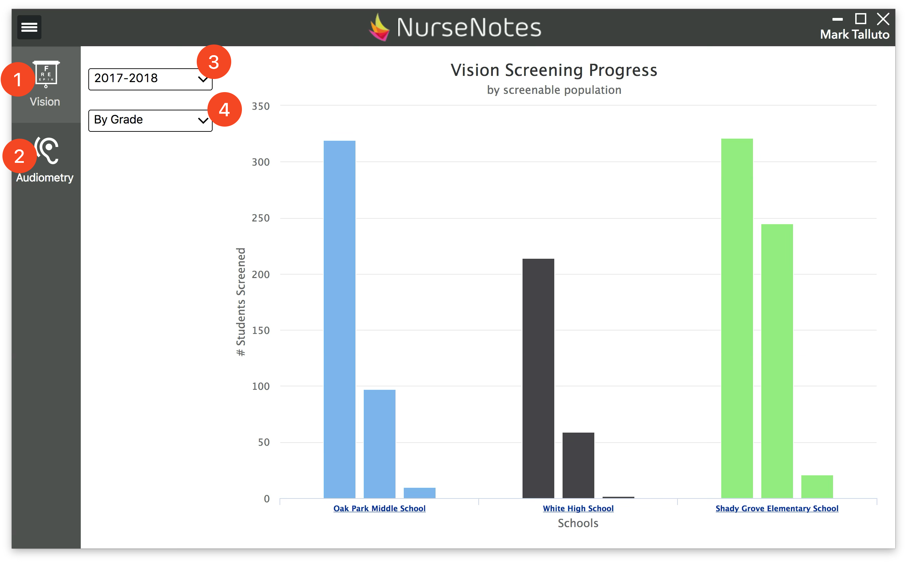

# Analytics

NurseNotes provides analytics tools so you can view your screening results in a visual way. In the Hamburger Menu, click “Analytics”. This will take you to the Analytics page, where you can view your data in the form of a chart.

You can see both Vision (1) and Hearing (2) data. You can view specific school years (3), broken down by different categories (4). This allows you to see the progress you’ve made in screening students, as well as to see how many referrals you’ve made. Hovering over each bar will show you more details about that population.

