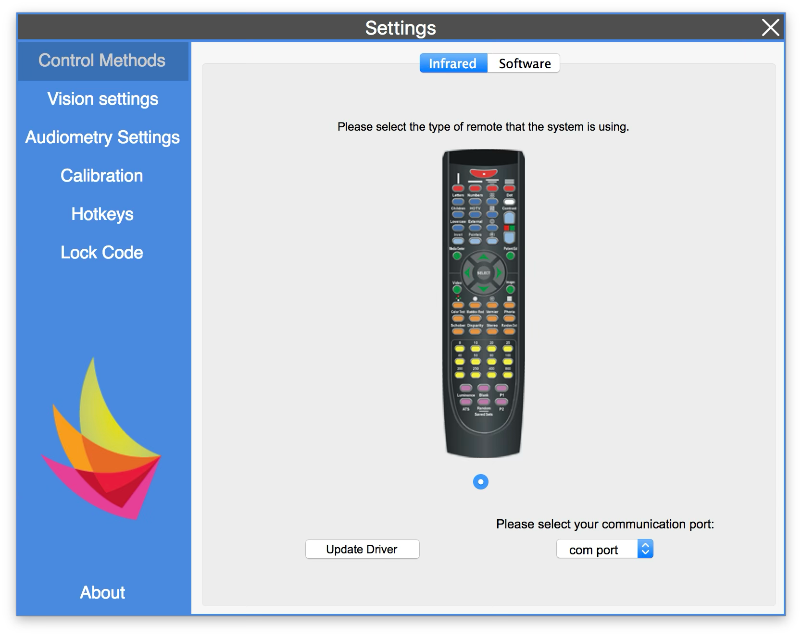
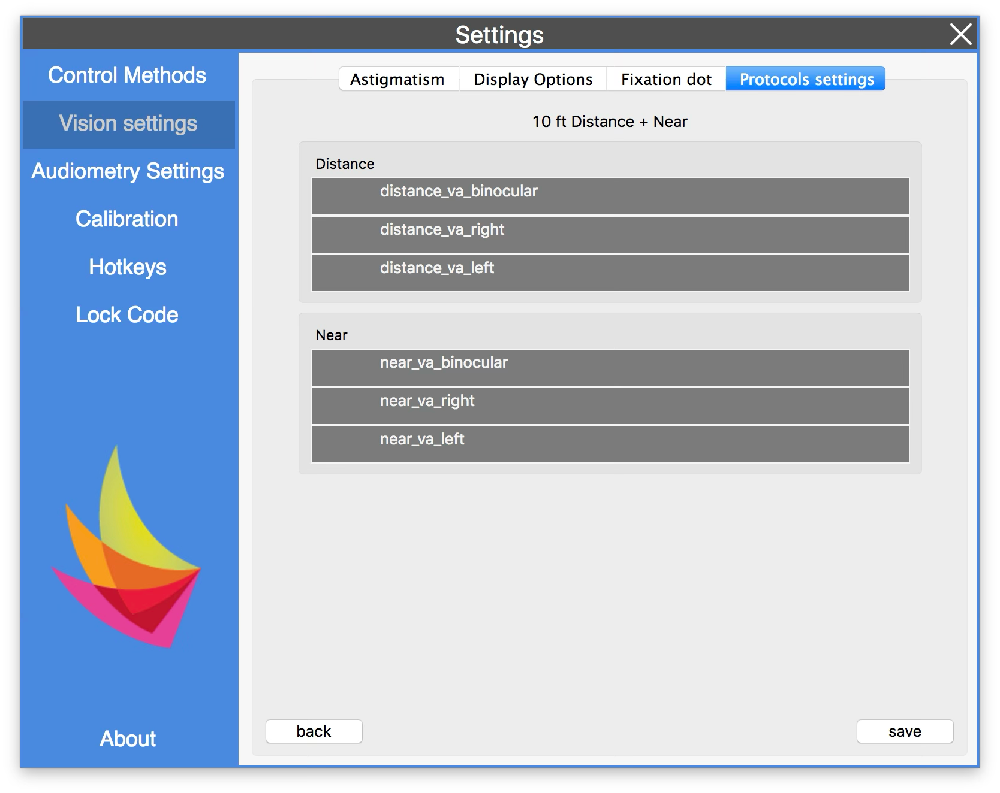
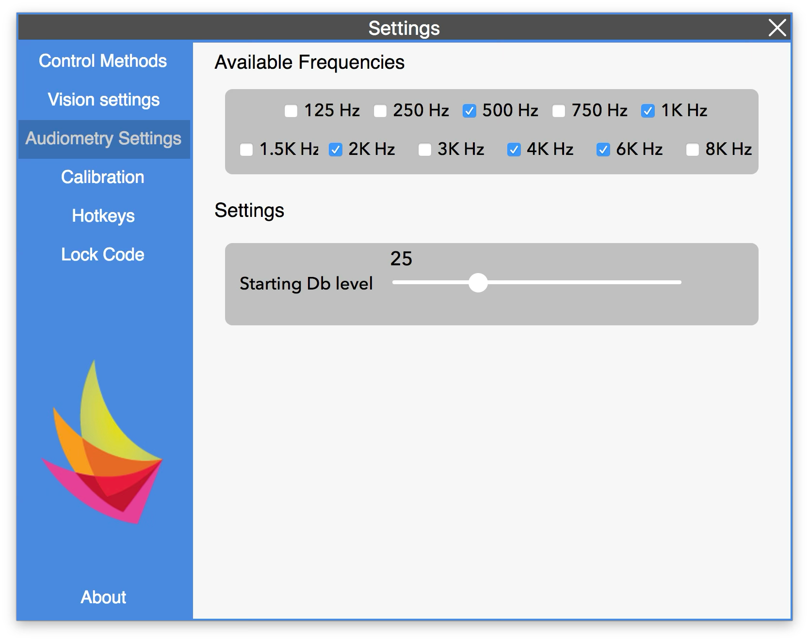
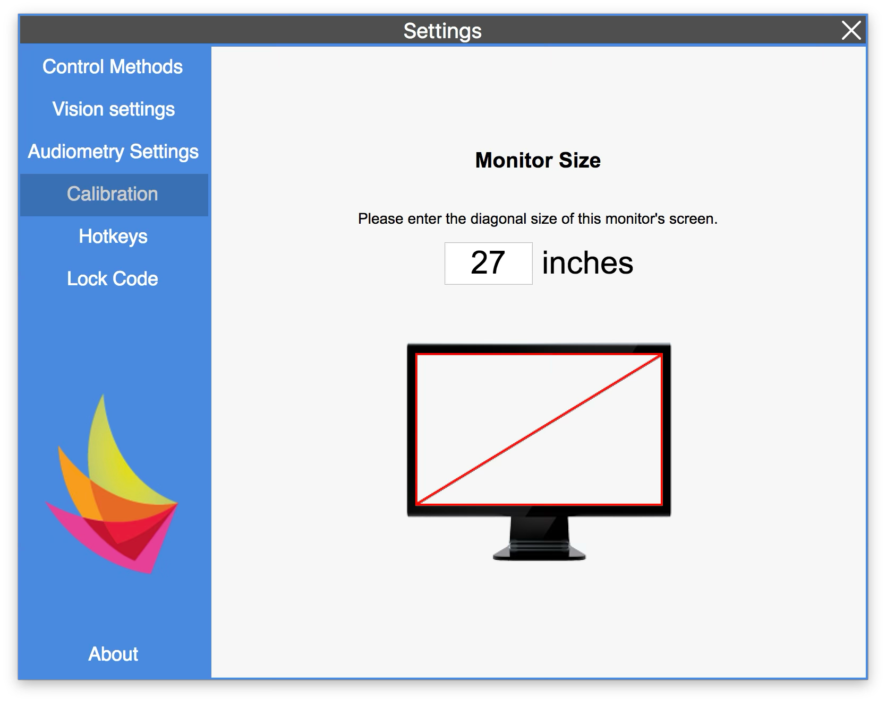
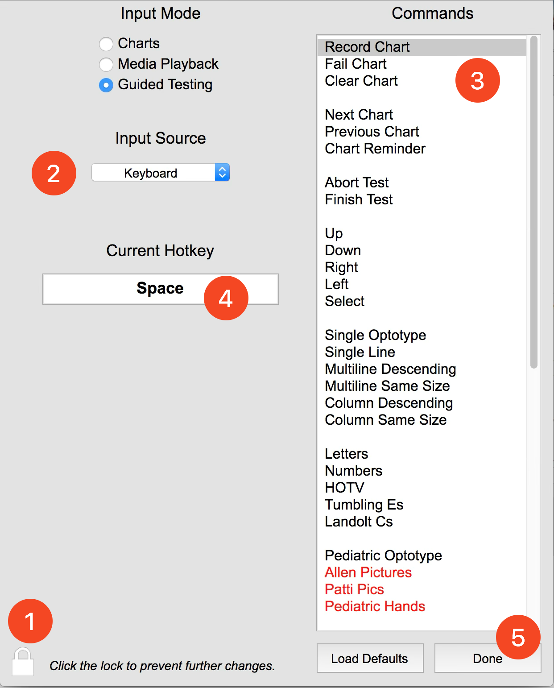
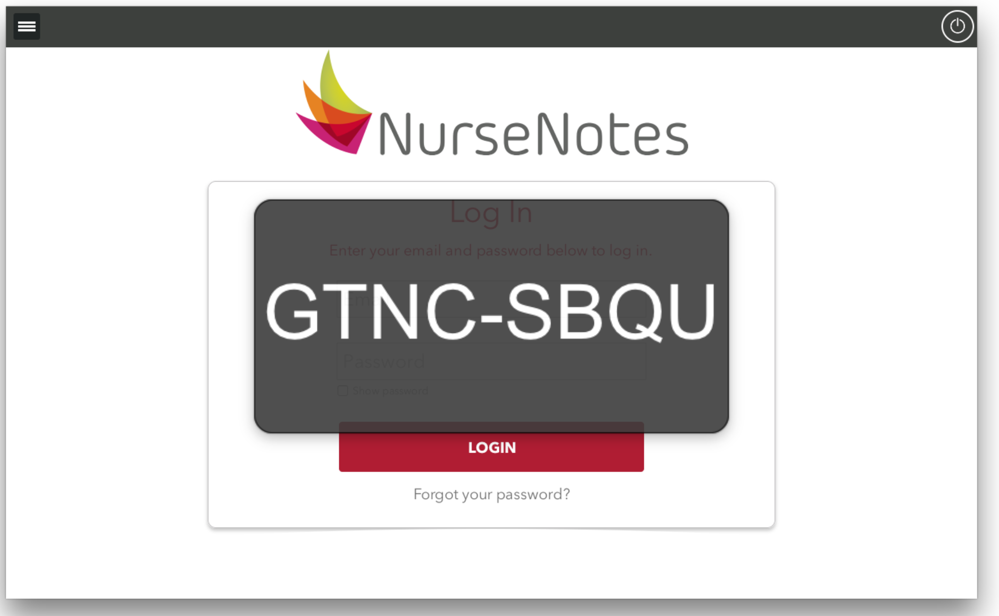

# Settings

Clicking the “Settings” button in the hamburger menu will open the Settings Menu. In this menu, you will find a variety of options that can help you configure NurseNotes to match your preferences. Most of the time, you won’t need to change any of these settings, but they are there in case you want to make any changes.

## Control Methods

On this screen, you will see a picture of a remote control. If you are having problems with your remote control and receiver, you can click the “Update Driver” button in order to install new drivers onto your computer. 

Additionally, if you click on the “Software” tab, you can connect an iPad in order to control NurseNotes during vision testing.

## Vision Settings

The Vision Settings Tab is used to change the settings of certain vision charts. Specifically, Astigmatism and Muscle Balance (Fixation Dot) settings can be updated. Additionally, the computer can be used to show vision charts on a second monitor (Display Options).

You can also use the “Protocol settings” to re-order the charts (e.g. you can do near vision before distance vision, or you can do binocular vision before right/left).

## Audiometry Settings

The Audiometry Settings Tab can be used to change the frequencies that you test during audiometry. You can also change the starting dB volume.

## Calibration

Calibration is necessary in order for your computer to draw the Vision Screening Optotypes at the correct sizing. 

* To do this, in the “Settings” menu, choose “Calibration”.
* Diagonally measure your computer's screen, in inches. (Don’t include the frame of the screen).
* Then enter that measurement into the field on top of the image of a screen.
Click the “x” in the top right to exit the Settings menu.

## Changing HotKeys

This menu will allow you to update hotkeys for both the remote control and the keyboard, specifically for when you are doing Vision Screenings. The default hotkeys can be found on page X. To change a hotkey:

* Click the lock image (1) in the bottom left to open it.
* Go to the dropdown menu under Input Source (2).  Select either **Keyboard** or **Remote 2009b**, depending on if you want to change a hotkey for remote control, or for keyboard.
* Click on the command you want to change from the list at the right (3).
* If you are updating a keyboard hotkey, press the new key you want to use for this command. It will show up under “Current Hotkey” (4).
* If you are updating a remote control hotkey, press the new button you want to use for this command.
* A dialogue may appear asking if you want to override the current binding. Click OK.
* Click Done (5).

## Lock Code

Every computer using NurseNotes has a special LOCK CODE (a.k.a. computer code) associated with it. Clicking the “Lock Code” option in Settings will show a popup with the 8 digit code. You may need this code when calling in to the NurseNotes support team. You can also access this code when you are NOT logged in, as part of the hamburger menu.

## About

Clicking on this icon brings up the about screen.  This screen shows what version of NurseNotes you are using as well as the lock code and change log.
