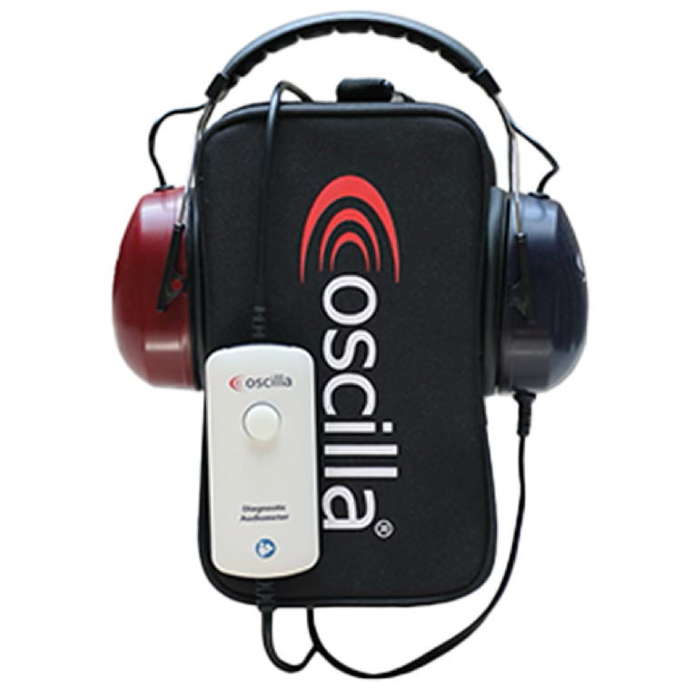

# Audiometry Hardware

NurseNotes uses the Oscilla A30, a computer-based audiometer. The headset for this is noise-cancelling, and plugs directly into your computer. There is a response button attached, but most often nurses use their keyboards to control responses. The headset comes in a carrying case, so you can easily carry the audiometer around to different school sites. Headsets are calibrated on an annual basis — normally we collect them during the summer. If you have any issues with the headset (e.g. if it was dropped or broken), please call Canela support and we’ll be happy to help.