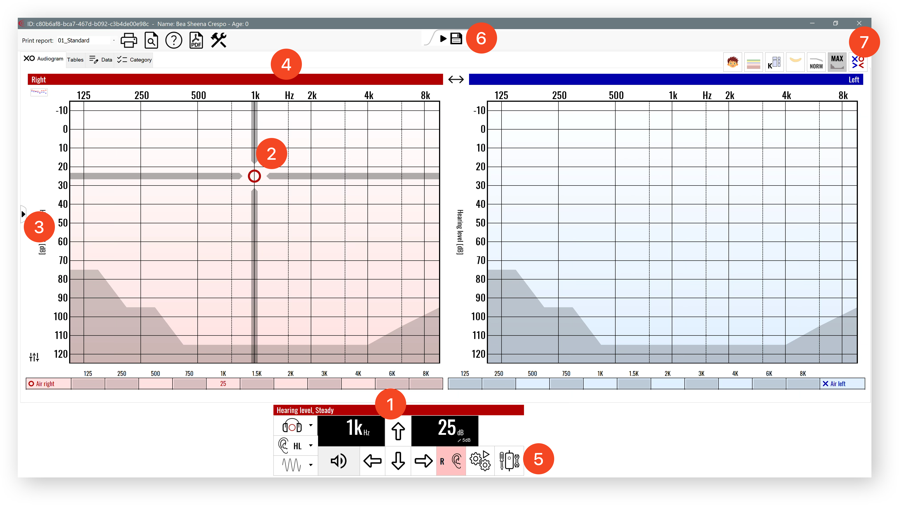
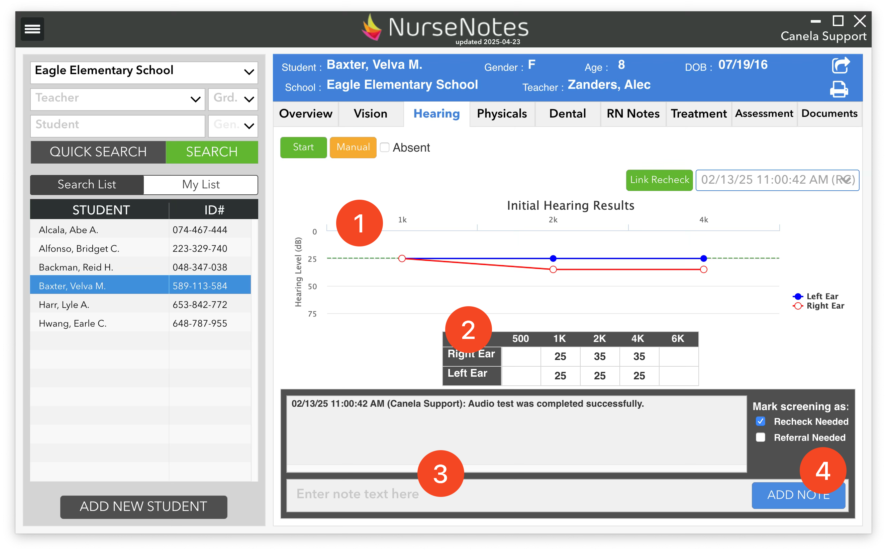
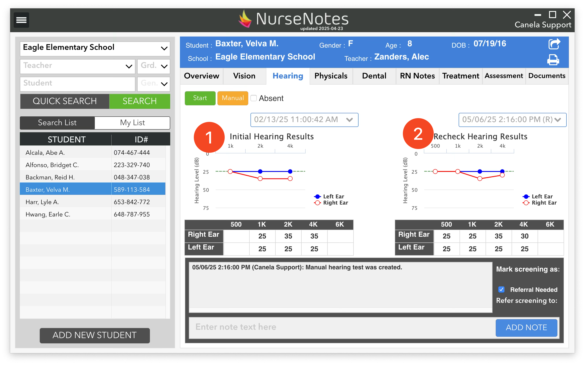

# How to Screen Hearing

Once AudioConsole has opened, you will see a pair of Frequency/dB charts. The Red side corresponds to the **Right Ear**. The Blue side corresponds to the **Left Ear**. 

At the bottom of the screen, you will see a control box (1). If you move your mouse across the chart (2), you will see that the frequency/dB level will change according to where your mouse moves. The dB level is shown on the left side (3), and the frequency is on the top (4). 

To play a sound, click on the chart, or press ++space++. This will also record that the student heard the sound. If the student didn’t hear, press the ++up++ on your keyboard to increase sound, then press ++space++ again. If you need to mark a frequency as Not Heard, press ++q++ to toggle.

You can press ++left++ / ++right++ arrows to change frequency, and press ++e++ to switch between different ears.

You can use also use the mouse to play sounds at specific frequencies and volumes. The Audioconsole program can be used to do either initial screenings or threshold screenings (when rescreening students that have failed their initial screening).

For older students, you can also use the “Autoscreening” button (5). This will play a set of sounds and record the student’s response from the audiometer’s response button. You may need to change some settings so this works correctly; ask the Canela team if you’d like to set this up.

Once you are done screening the student, click the “Save” Icon (6) in the top-middle of the screen. This will save the results and take you back to the NurseNotes home page.

If you need to Abort the screening (quit without saving), click on the “x” in the top right (7) to exit the AudioConsole program. A popup will appear, asking if you want to Abort, mark the student as UTT, or Save.

# Hearing Results

Once you are back on the NurseNotes home screen, you will see a graph of the hearing results (1). If the student has failed the screening (our default criteria is worse than 25dB on two frequencies in one ear, or worse than 35 dB on any frequency), a popup will appear asking if you want to mark the student as “Recheck Needed”. Generally you should choose “Yes”, unless you have a specific reason you don’t want to recheck this student.

You will also see the results in a table (2). You can add notes (3) or mark screenings as needing a recheck or referral (4).

## Rechecking Hearing

After your initial screenings, you may have some students that have failed their hearing screenings, and need to be rechecked. To do this, you can open the Quick Search pane, go to “Hearing”, and click on the button to list the students that need to be rechecked. Then, select the student you want to recheck. When you click the “Start” button, a dialog will pop up saying that the student was marked as “Recheck” previously, and will ask if this is the recheck screening for that student. Click “Yes”.

Now, you will be taken to AudioConsole where you can do a full threshold screening. Once you’re done, the program will again return you to NurseNotes. If the student has failed the threshold screening, you will be prompted to refer the student.

Students that are rescreened will have both their screening results displayed side by side, with the initial screening on the left (1) and the recheck screening on the right (2).