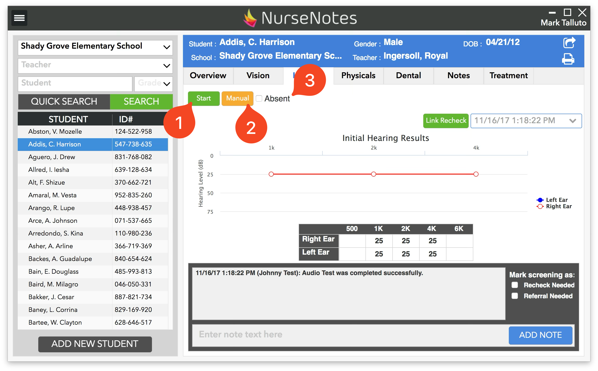
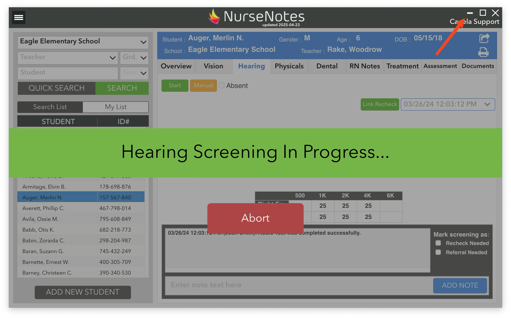

# Starting a Hearing Screening

To start a hearing screening, first plug in the audiometer into the computer. In NurseNotes, click on the “Hearing” tab. You will see a “Start”, “Manual”, and “Absent” button at the top of the page. Click on “Start” (1) in order to start testing the student’s hearing. Click on “Manual” (2) to add a manual screening (OAE, Functional hearing, etc) and click on “Absent” (3) to mark the student as absent.

The main NurseNotes window will minimize, and another program “AudioConsole” will open. This may take up to a minute on the first student you screen. If you see the NurseNotes window, it will show a banner “Hearing Screening in Progress”, with the option to abort the screening. Click the “minimize” button in the top right corner, then use the AudioConsole program to do the hearing screening.