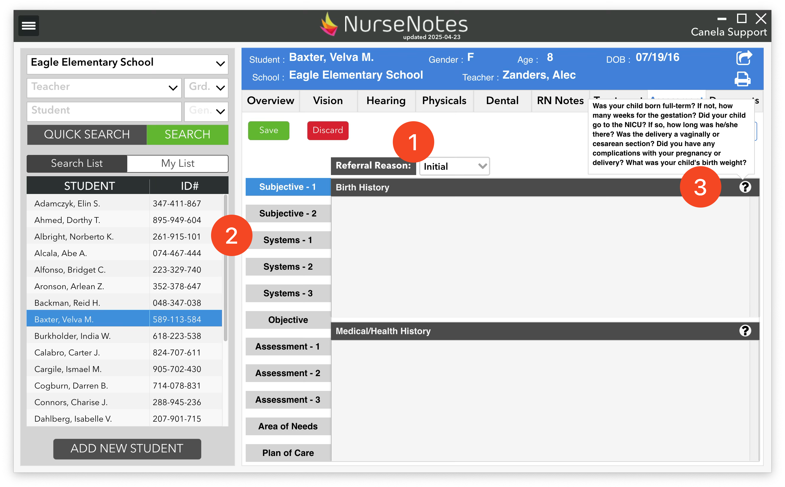

# Assessment

The Assessment tab allows you to document your IEP assessments, both initial and triennials (1). It will provide you with a list of sections (2) with different areas like Birth History, Nutrition, Neurological Assessment, etc. Each area has some prompts (3) to ask about the student that you can fill.

Additionally, you can link vision, hearing, and physical screenings to the assessment. Once you’re finished, you can save the assessment (4), and print out an assessment (either via the top right icon (5) or the print center.)