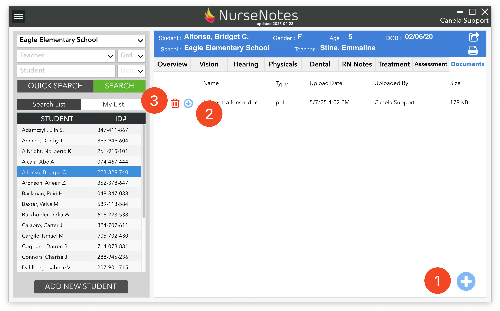
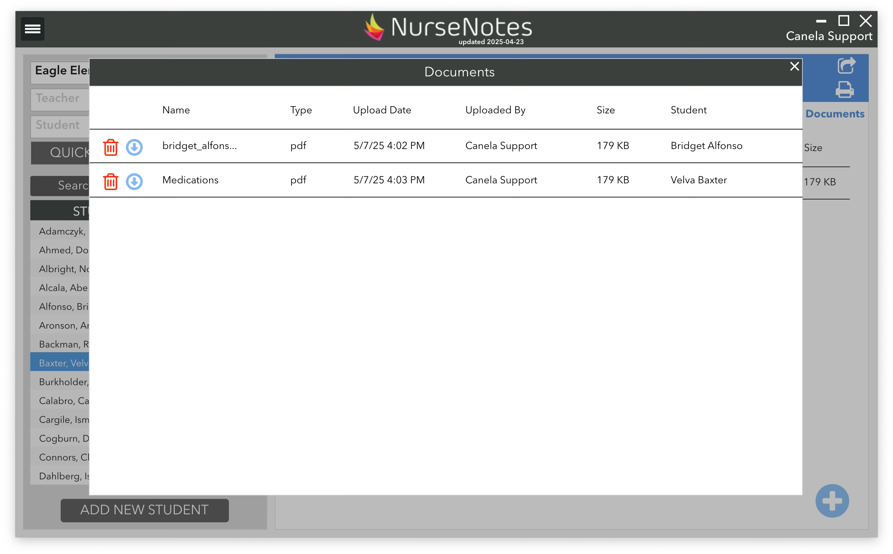

# Documents

Each student has a “Documents” tab where you can upload documents (1), download documents (2), and delete documents (3). You can store a student’s medical plan, doctor’s orders, medication lists, or anything else you may need.

You can also access all documents via the Hamburger Menu. This will show a full list of all documents for all students in the district.
