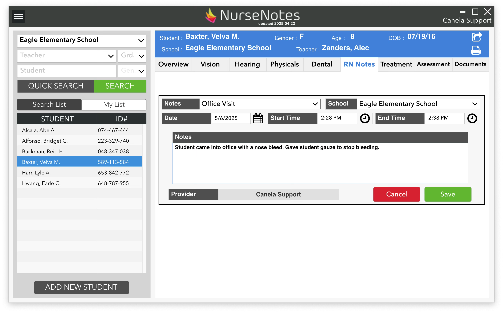

# RN Notes and Treatments

The **RN Notes** section is used to document things like Office Visits, Phone Calls, or other information about the student. The types of notes are customizable; feel free to contact Canela Support to change categories.

**Treatments** are used to document actual medical treatments (e.g. catheterization), generally for IEP students. There are many different treatments, so please contact Canela Support to customize the treatment type and specific fields that you need to document.
