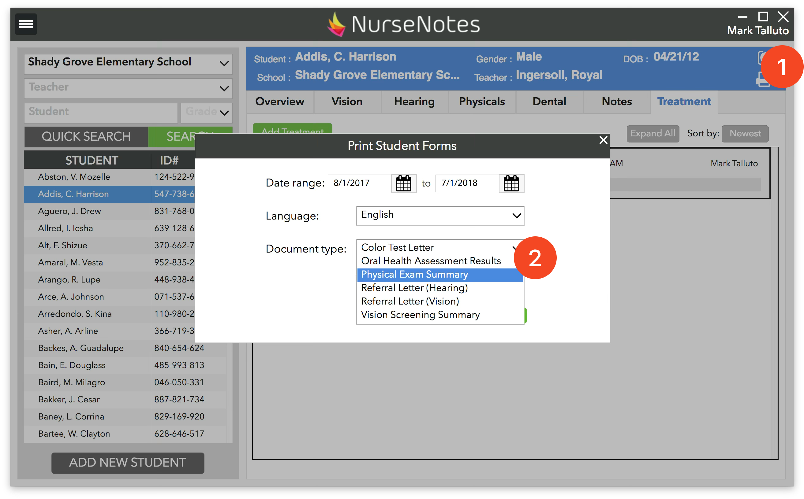
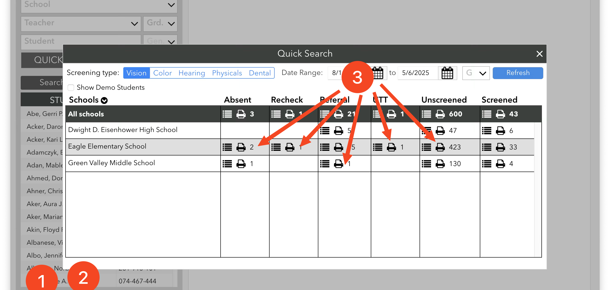

# Other Printing

You can also print documents directly from the NurseNotes home screen. There are two ways to do this.

First, you can select a student and click the “Print” Icon in the top right corner (1). This will bring up a screen where you can choose the document language and type (2). You can also choose whether you want to include the address.

You can also click the “Print” Icons on the “Quick Search” pane (3).

