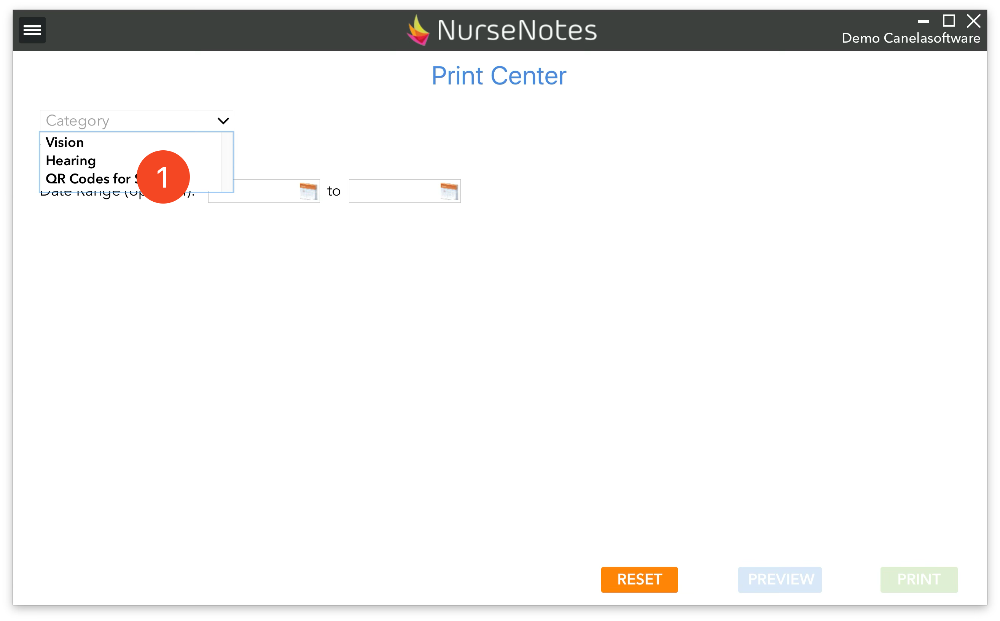
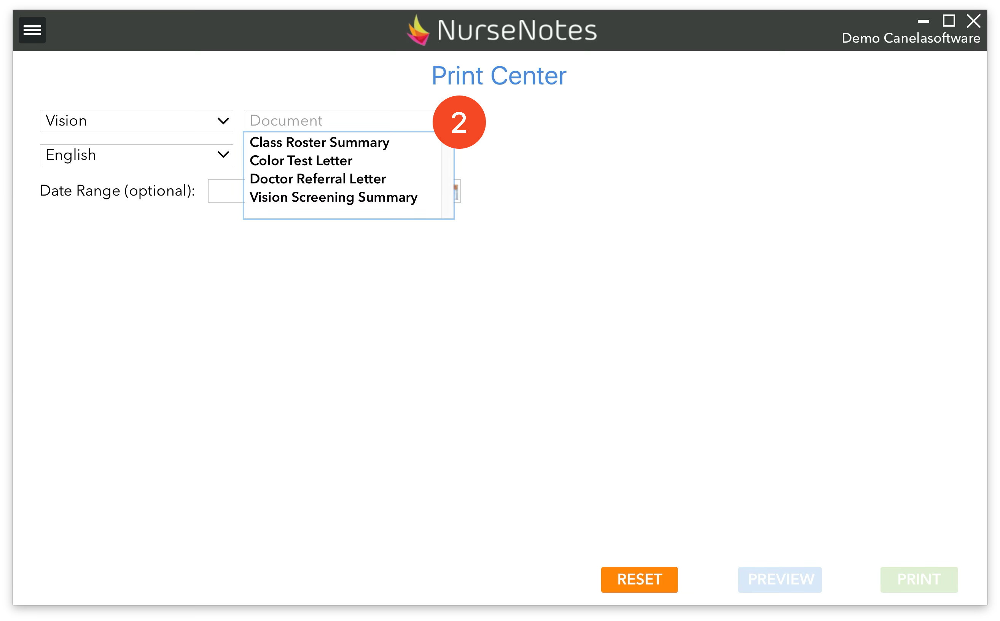
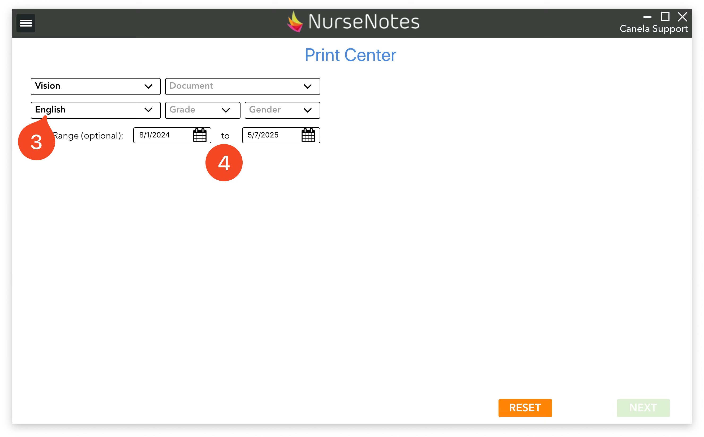
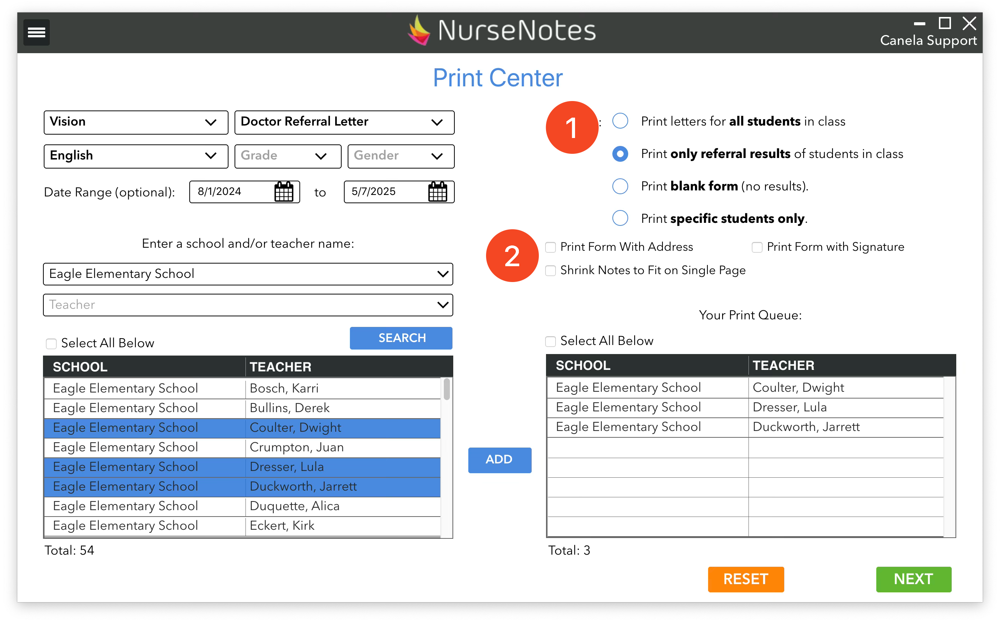
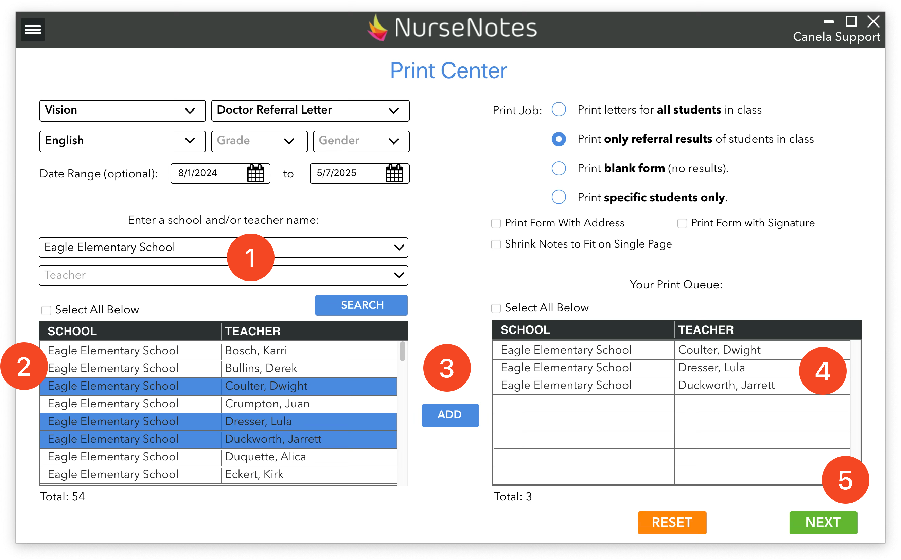
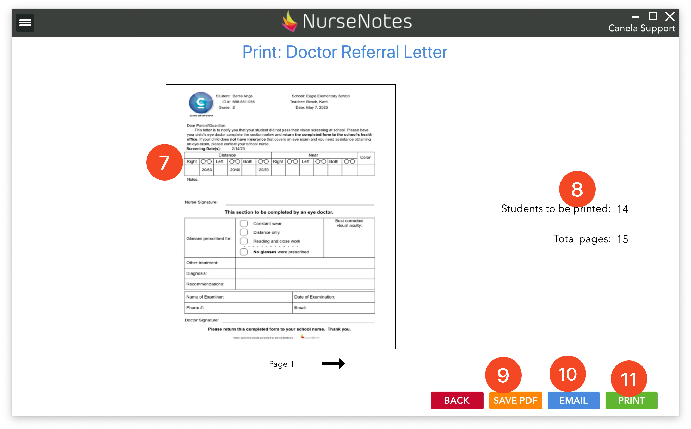

# Print Center

In the Hamburger Menu, click on the “Print Center” button in order to open the NurseNotes Print Center. This is where you can choose an print a variety of documents.

{align: left}

From this page, you can choose a category and a language, as well as a date range. You can then choose a specific document to print. These are different for each category.

{align: right}

## Vision

* **Class Roster Summary** gives you a list of all the students and their results.
* **Color Test Letter** is a letter informing parents that their child may have a color deficiency.
* **Doctor Referral Letter** is a form sent to the parents and must be filled out by the child’s eye doctor.
* **Vision Screening Summary** is a form that shows the results of the vision screening.

## Hearing
* **Class Roster Summary** gives you a list of all the students and results.
* **Doctor Referral Letter** is a form sent to the parents and must be filled out by the child’s eye doctor.
* **Hearing Screening Results** is a form that shows the results of a hearing screening.

## Dental
* **Oral Health Assessment** Form is the form for dentists to fill out
* **Oral Health Assessment** Results are the results of dental assessment

## Physicals
* **Physical Exam Summary** shows the results of physical screenings.
* **School Entry Health Exam** are a form for students to fill out prior to entering school.

## Other
* **Assessments** shows the assessment results of either an initial or triennial IEP assessment.
* **Medical Notes** shows a list of medical notes for a student
* **Global Class Roster** shows a full class roster.
* **QR Codes** for students allow you to print QR codes for each student in a class so they can be scanned via iPad for screenings.
* **Treatments** allow you to print a treatment log for a student.
* **Response Cards** allows you to print HOTV response cards.

You can choose a language (3) (for some documents), and also filter some of the results via grade level, gender, and date range (4). This allows you to select the students and screenings that will be printed.

Once you’ve chosen a document to print, you will have a choice how to filter students to print (1). Depending on the document, you may have different choices, but in general they are:

**Print all results by teacher** - print any screening result for all students, and choose which teacher to print

**Print all results by school** - print any screening result for all students, and choose which school to print

**Print specific student** - print only results for one specific student.

**Print only filtered results** - print screening results that match the specific filter: either absent, recheck, or referrals

**Print blank form** - print an empty form with no results filled in

Some documents will also allow you to choose options to for printing (2). You can choose to print forms with addresses on the back (for use with a windowed envelope), you can automatically shrink notes to fit on a single page, and you can print forms with signatures (Set in your [Account](../analytics-status-accounts-settings/account.md) page).

Once you’ve chosen what types of results you want to print, choose a school and/or teacher from the drop down menu (1) and click search. This will show all teachers that match your search on the left side (2).
You can then select the teachers you want to print, and click “Add” (3). This will move those teachers to your print queue (4). When you’re ready to print, go ahead and click the “Next” button (5).

You will see a preview (7) along with the number of pages (8). You can then save the document as a PDF (9), email the document (10), or you can print it (11). Saving the document as PDF will save into a “NurseNotes PDF” folder on your desktop, also accessible from the hamburger menu.

