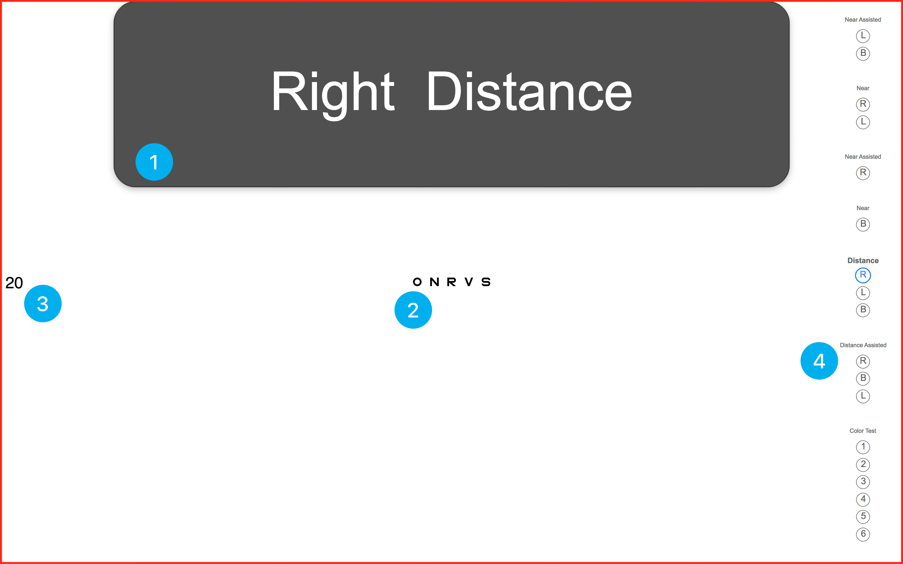

# How to Vision Screen

Once you’ve started a vision screening, the software will switch to a fullscreen view and will show an eye chart.

You will see what you are currently testing in a big bubble at the top (1). For instance, it may be “Right Distance”, meaning the right eye for distance vision. Or it might be “Both Assisted Near”, meaning binocular near vision with glasses on.

The letters will show up in the middle of the screen (2), and the current visual acuity (e.g. 20/20, 20/32, etc.) will show up on the left (3). Finally, you can see your progress through the protocol on the right sidebar (4).

You can control your vision screening using either your remote control, or your keyboard. (See [Hotkeys](../hotkeys/hotkeys.md), for more details).

In order to control the size of the letters, you can press the ++up++ and ++down++ arrows. Use this to test the student at different size optotypes. If you need to switch optotypes, you can press ++k++ for pediatric (Allen symbols or PattiPics), ++z++ for HOTV, or ++s++ for standard letters. If necessary, you can also switch from one line ++l++ to a single letter ++o++. Pressing ++p++ will bring up a pointer so you can point to specific letters.

Once you have determined a child’s result for a specific Eye/Distance, press Spacebar in order to record that result. The software will save the result and move you on to the next Eye/Distance that needs to be tested.

If you want to skip an Eye/Distance, you can press ++period++. You can go back to a previous Eye/Distance using ++comma++. You can also click on the small blue circles on the right sidebar to skip between eyes.

If you have made a mistake, you can jump to the Eye/Distance, and then press ++backspace++ in order to remove the result.

For Color Vision, Astigmatism, and Muscle Balance, press ++space++ to pass, or ++f++ to fail the student.

Once you’ve finished testing, you will be directed to either press ++space++ to finish, or to go back and make any changes that you need to make.

If you want to Abort a screening (exit without saving), press ++esc++. If you want to finish and save while you’re in the middle of a test, press ++d++ for “done”.