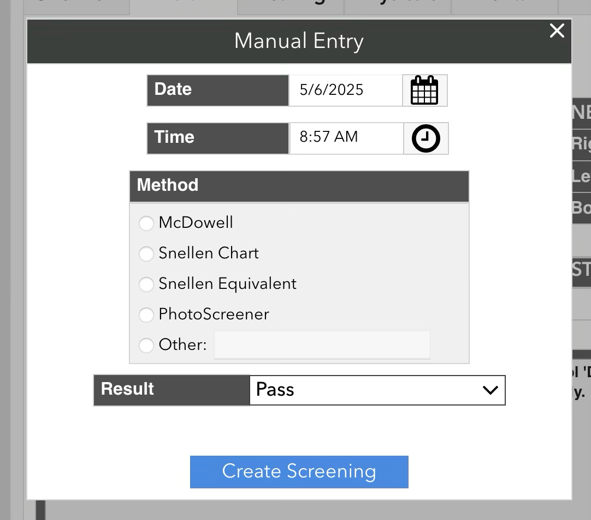

# Manual Vision Screening

If you could not test the student using the eye chart (e.g. if they are an IEP student that needs a functional McDowell or photoscreening instead), you can use the “Manual” test to record their results. Select “Manual” as the protocol, and click “Start Test”. This will bring up a popup allowing you to input just a “Pass” or “Fail” vision screening result, along with the date, time, and method of the screening.