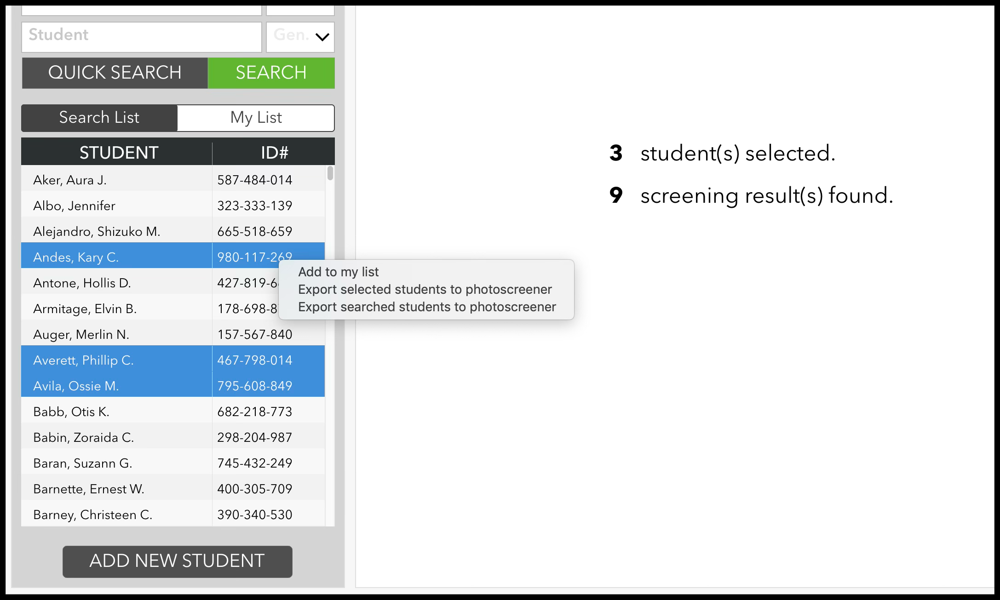
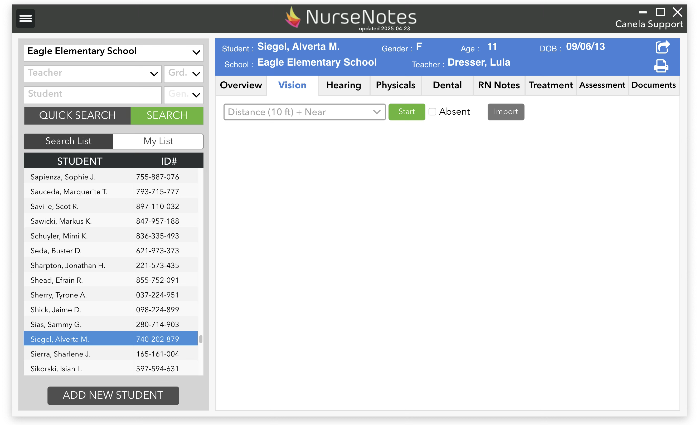
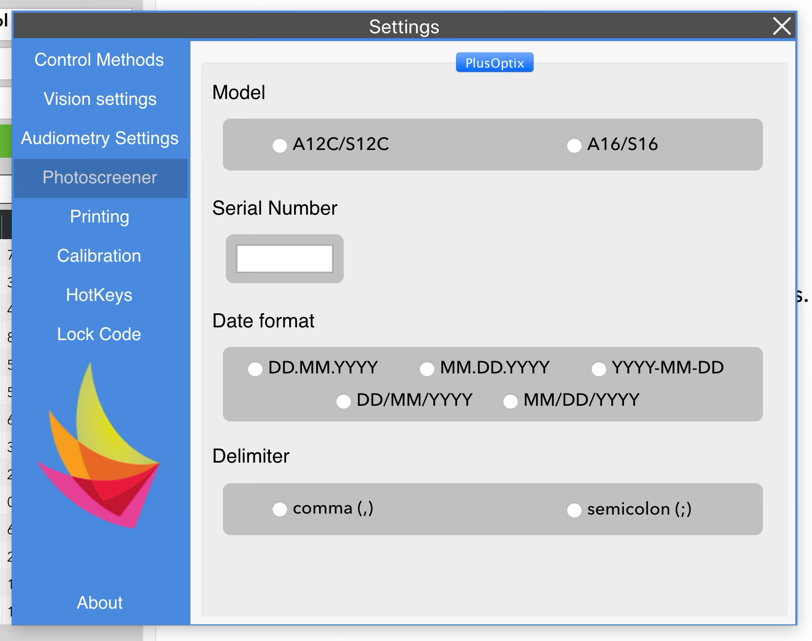
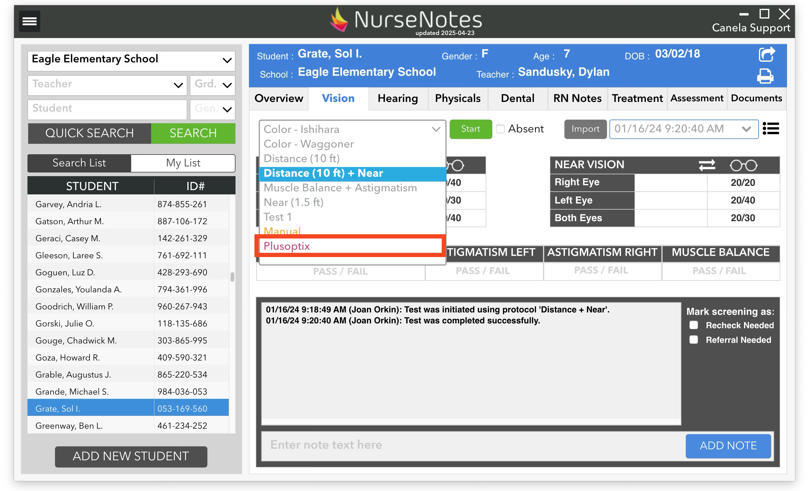

# PhotoScreener Integration

There are two different photoscreeners that NurseNotes supports: PlusOptix and Spot. For both photoscreeners, we support exporting a CSV list of students, and then importing the results from a USB. Additionally, for the PlusOptix wifi-enabled photoscreeners, we also support direct connecting to the photoscreener.

## Exporting Student Lists

After finding the students you want to screen, you can right click on the list of students and select either “Export selected students to photoscreener” or “Export searched students to photoscreener”, depending on if you want to screen just the selected students, or all students in the search results. You will then be prompted to save the students in a CSV on a USB drive.

## Importing Photoscreener Results

Once you’ve screened students on your photoscreener, export the results onto your USB, and connect your USB to your computer. In NurseNotes, select any student and click the “Import” button on the Vision tab. This will bring up a dialog directing you to choose the CSV file to import.

## Direct Photoscreener integration (PlusOptix only) 

For PlusOptix devices with wifi, you also have the option of screening students directly from NurseNotes. To do this, first open Settings from the hamburger menu. Under “PhotoScreener”, select “PlusOptix” and fill in your serial number, model, and formatting information (it should match your device settings on the PlusOptix). Connect your PlusOptix screener to your computer via wifi.

Then, select your student, choose “PlusOptix” as your screening protocol, and hit “Start”. Once you’ve screened the student, the screening will be saved in NurseNotes.