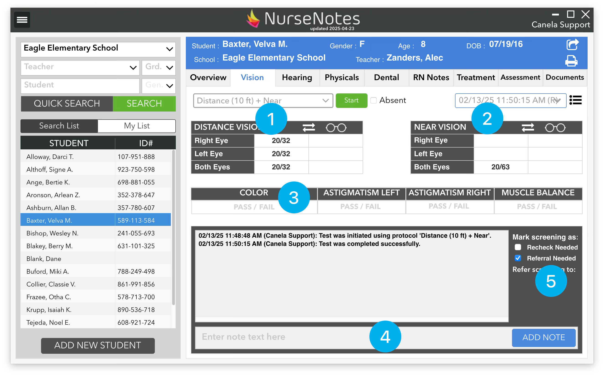

# Vision Results

After finishing a vision screening, you will be returned back to the home screen. Here, you will see the results of the latest screening that you’ve done. You can see the distance results (1) and near results (2) in the top section. There are fields for vision both with and without glasses (in case you test for both). You can swap these results by clicking on the “⇄” sign. If necessary, you can change vision results here by clicking on the result and selecting the corrected result from the dropdown menu that appears. **You can only change results the same day that you did the screening**.

Color, Astigmatism, and Muscle Balance results are displayed on the next row (3). These can be changed by clicking on either “Pass” or “Fail”. Below that, you will see the “Notes” section (4). You can enter any notes about the screening here — e.g. if the student was squinting, or if you had to do anything special.

Finally, you can mark the student as needing to be rechecked, or needing to be referred (5). 
You can see the date and time of the latest screening in the dropdown at the top left of the screen (6). To see previous screenings that have been done, you can click on the dropdown and select the screening date/time. This will show a detailed view of a previous screening for a student. You can also see a list of all prior screenings by clicking the “list” icon. 