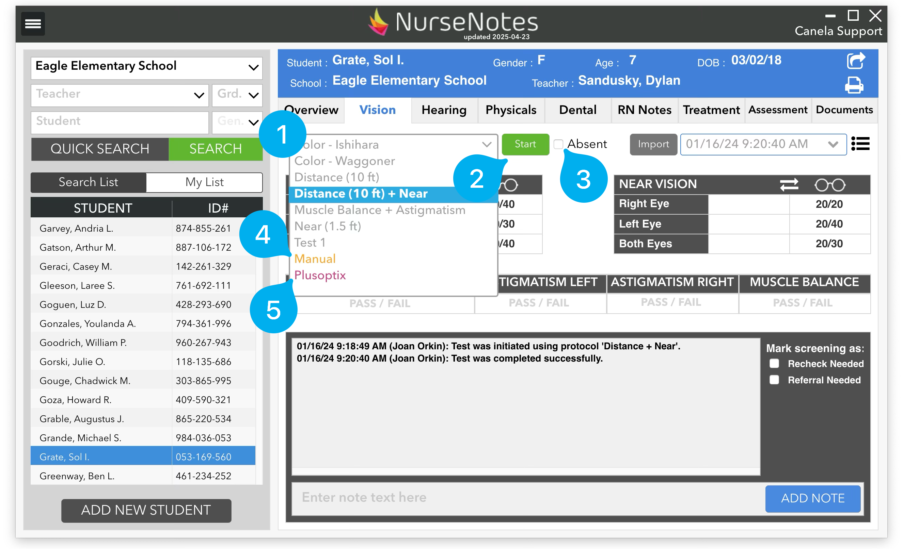

# Starting a Vision Test

After selecting a student, you will see a dropdown list (1), along with a “Start” button (2), and an absent checkbox (3).

!!! note

    If you haven’t calibrated your screen yet, please do so before starting a vision screening. (See [Calibration](../analytics-status-accounts-settings/calibration.md))

The dropdown shows all possible Protocols that can be used to test a student. These are the different tests you have available — for instance 10ft Distance, Near, and Color.  We can customize these if you want to have different protocols — you may want to have a 6ft distance test, for when you don’t have enough space to do a 10ft distance screening. Additionally, the dropdown has options for Manual testing (4) and PlusOptix photoscreener integration (5). We’ll cover these later.

Once you’ve selected the correct protocol, you can click the “Start” button to start screening the child. If the student is absent, you can click the “Absent” checkbox to mark the student as absent.

Once you’ve selected the correct protocol, you can click the “Start” button to start screening the child. If the student is absent, you can click the “Absent” checkbox to mark the student as absent.

